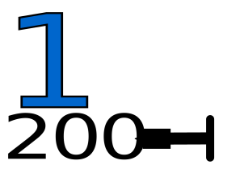

# ASVZ Sola 2022

## Übergabe Startnummern-Schilder für Uetliberg

Die Schilder in [svg/*](svgs/) sind modifizierte Schilder welche die Übergabe
am Standort Uetliberg verbessern sollen.

Alle Schilder sind hier: [All.pdf](All.pdf).


# PDF Konvertierung

```shell
./convert-to-pdf.sh
```





